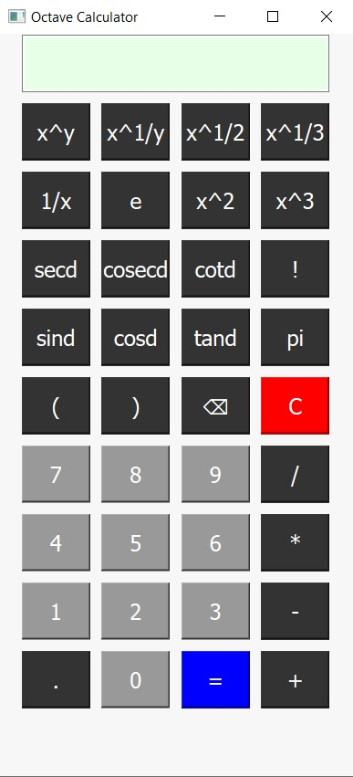

---
# Octave Calculator  

Octave Calculator is a graphical calculator built using GNU Octave's GUI components. It features an intuitive interface with various mathematical functions, including basic arithmetic, trigonometric operations, exponents, factorials, and special constants like π and e.  

## Features  
- **Basic Operations**: Addition, subtraction, multiplication, division  
- **Exponential & Roots**: Square, cube, nth power, square root, cube root  
- **Trigonometry**: Sine, cosine, tangent, secant, cosecant, cotangent (in degrees)  
- **Special Functions**: Factorial, reciprocal, Euler’s number (e)  
- **Clear & Backspace**: Reset calculations or delete last entry  
- **Interactive UI**: Well-organized button layout with color-coded functionalities

## Calculator Preview



## Installation  
1. Ensure GNU Octave is installed on your system.  
2. Clone this repository:  
   ```bash
   git clone https://github.com/Thamindu-wijerathne/octave-calculator.git
   ```  
3. Open Octave and navigate to the project directory.  
4. Run the script:  
   ```octave
   calculator
   ```  

## Usage  
Click the buttons to perform calculations or enter expressions manually. Press `=` to evaluate expressions, `C` to clear, and `⌫` to delete the last character.  

## Future Enhancements  
- Support for logarithmic functions  
- Memory functions (M+, M-, MR)  
- Additional mathematical operations  

---
